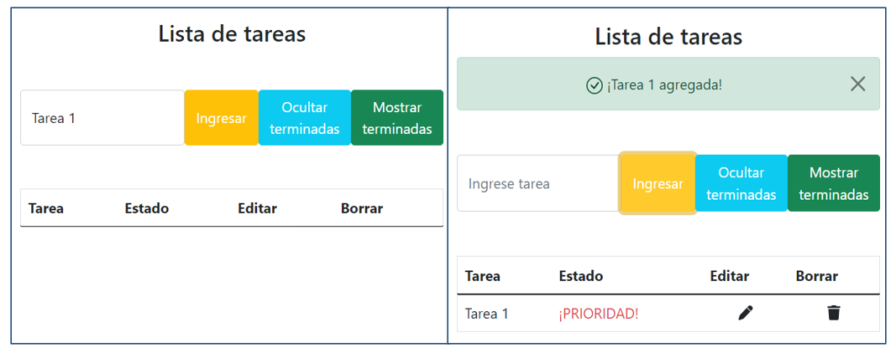
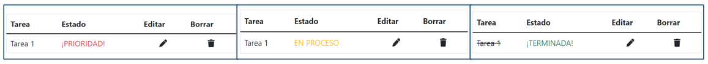
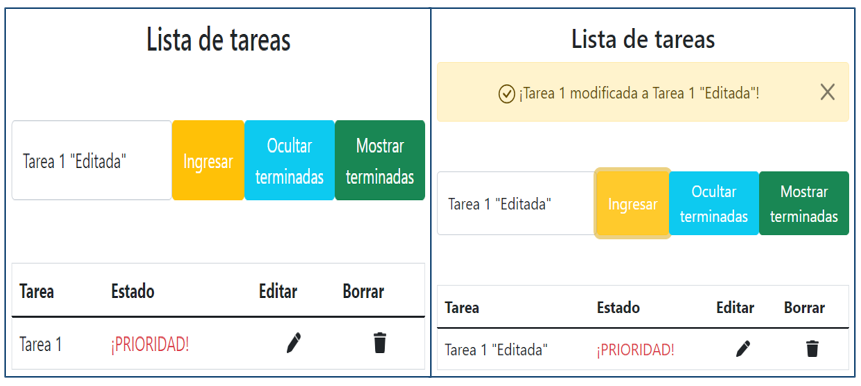
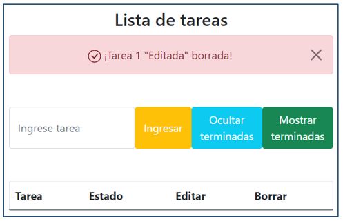

# Proyecto: ```Lista de tareas```

Este proyecto, que fue parte de la asignatura Desarrollo de aplicaciones para internet, tiene como objetivo permitir que los usuarios de la aplicación gestionen sus tareas. Una de las características que hace que este proyecto sea potente es el uso de la biblioteca Pinia. Pinia es una biblioteca de gestión de estado para aplicaciones Vue.js que ofrece una forma más sencilla y flexible de manejar el estado de la aplicación. A pesar de que el proyecto en sí es sencillo, Pinia lo potencia y hace que el código sea más fácil de leer y mantener, lo que ayuda a mejorar la productividad y a mantener un código más limpio y escalable.  
Debido a que se generaron los archivos estáticos del proyecto, es posible visualizar el sitio web en ejecución a través de la siguiente URL: https://justfym.github.io/Proyecto_ListaDeTareas_VueJS/
### Stack de tecnologías.
<p align="center">
  
</p>

#### Las imágenes de la plataforma web se presentarán a continuación y por caso de uso.

## Caso de uso: ```Agregar tarea```
<p align="center">
  
</p>

## Caso de uso: ```Cambio de estado```
<p align="center">
  
</p>

## Caso de uso: ```Editar tarea```
<p align="center">
  
</p>

## Caso de uso: ```Borrar tarea```
<p align="center">
  
</p>

#### Además, existen dos casos de uso adicionales en la aplicación, los cuales son "Ocultar terminadas" y "Mostrar terminadas". Estas funciones se encargan de permitir al usuario visualizar solamente las tareas que fueron completadas o de ocultarlas en caso de que se quiera detallar en las tareas que aún no se han finalizado.